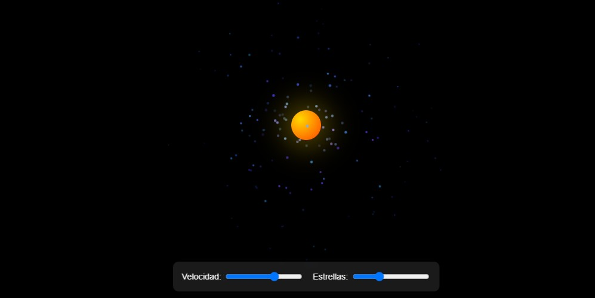

# 🌌 Simulador de Galaxia Rotatoria

Simulación interactiva de una galaxia espiral con movimiento orbital 3D, efecto parallax y generación procedural de estrellas.

## Características Principales
- 🌀 **Núcleo galáctico luminoso** con efecto de brillo
- ✨ **Sistema estelar procedural**:
  - Más de 500 estrellas generadas algorítmicamente
  - Tamaño y color basados en la distancia al núcleo
  - Movimiento orbital con diferentes velocidades
- 🌠 **Efectos 3D avanzados**:
  - Transformaciones CSS en 3D
  - Parallax por capas de profundidad
  - Brillo dinámico angular
- 🎚️ **Controles en tiempo real**:
  - Velocidad de rotación ajustable
  - Densidad estelar configurable
  - Redimensionamiento responsivo
